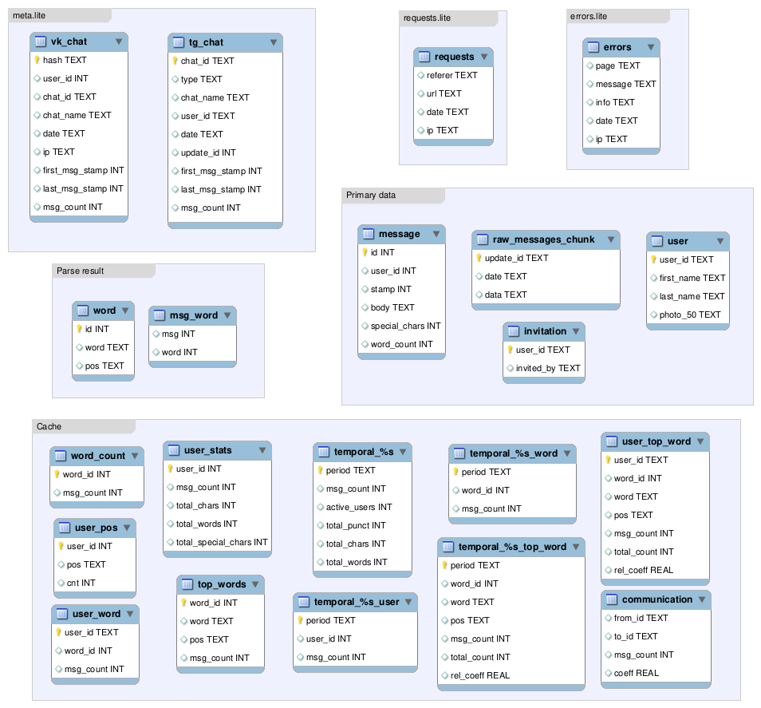

# Анализатор групповых чатов vk/telegram

Ярослав Сергиенко,

Весенний проект, 2 курс ФКН ВШЭ, ментор -- Салагаев Е. А.

## Функциональность

Веб-сервис для анализа групповых чатов vk и бот-анализатор чатов telegram.

Демо-версия отчета: http://198.211.123.188/vk9837652936

### Telegram

1. Для telegram необходимо добавить в чат бота @GChatStatsBot.

2. Ответным сообщением он вернет ссылку с постоянно обновляемым отчетом.

3. При упоминании своего имени бот повторно посылает ссылку на отчет.

### VK

1. Для чатов vk необходимо получить токен на чтение личных сообщений путем копирования
данных из адресной строки в форму на странице http://198.211.123.188/upload

2. Далее пользователь выбирает групповой чат для анализа.

3. Проблема состоит в том, что токен должен использоваться с того же ip-адреса, с которого он был
получен, поэтому сообщения с сервера vk сначала загружаются в браузер пользователя, и только
затем на сервер.

4. По окончании загрузки данные обрабатываются на сервере (в отличие от telegram, в дальнейшем они
не обновляются) и происходит редирект на страницу с отчетом, которой можно поделиться с другими
участниками чата.

### Структура отчета

* Общая информация: тип и название чата, число сообщений,
  анализируемый период, кем и когда был загружен отчет, последнее обновление.

* Граф приглашений участников: целиком строится для vk,
  в telegram учитываются только те приглашения, которые произошли после приглашения бота.

* Граф общения: какие пары участников общались чаще других. Считается, что участники
  "общаются", когда их сообщения идут подряд. При этом идет нормировка по числу исходящих
  сообщений, чтобы уравнять участников с разными порядками числа исходящих сообщений.

* Рейтинг пользователей: по алфавиту, дате регистрации (id), числу сообщений, средней длине
  сообщений, проценту существительных/прилагательных, проценту знаков пунктуации. Для каждого
  пользователя указывается ссылка на его профиль и аватар (только для vk). Также отдельно указаны
  пользователи, не оставившие ни одного сообщения. Также есть возможность выбрать одного из пользователей.

* Временные графики: число сообщений, число активных участников, процент знаков пунктуации, число
  сообщений, содержащих выбранного пользователя, число сообщений, содержащих выбранное слово.
  Возможен выбор разных временных шкал: по часам, по дням недели, по неделям, по месяцам.

* Топ слов. Самые частые слова (не считая стоп-слов), типичные слова для каждого из участников (частота
  которых больше средней частоты), типичные слова для дней недели и месяцев.
  Есть возможность выбрать одно из слов.

* Для улучшения производительности графы и временные графики объединены друг с другом и по умолчанию скрыты.

## Установка

Требуются python3, pip, virtualenv. Примерные команды для установки:
```
git clone https://github.com/pallada-92/GroupChatStats.git
cd GroupChatStats/groupchatstats
virtualenv venv
source venv/bin/activate
pip install -r requirements.txt
python server.py
```
При первом запуске сервер загрузит необходимые js-библиотеки.
По умолчанию используется порт 80, для этого требуются права суперпользователя.
Номер порта можно исправить: переменная port в файле server.py.
В файле server.py можно исправить переменную server_url, чтобы она содержала настоящий адрес сервера, 
однако это не обязательно (это нужно для формирования правильных ссылок в исходящих сообщениях бота telegram).

## Реализация

* html-файлы и py-файл сервера в папке gchatstats сгенерированы автоматически.
* Исходный код писался в jupyter notebook, ноутбуки находятся в папке notebooks.
* Сервер писался на tornado, однако без использования асинхронности.
* Приведение слов к начальной форме -- pymorphy.
* База данных -- sqlite, ORM не используется.
* Фронтенд использует jQuery, Ramda, React и Requirejs. Также visjs используется для графиков, а fontawesome для иконок.
* Большая часть анализа проводится при помощи sql-запросов, результаты кешируются во множестве таблиц.
* По умолчанию сервер раздает статические страницы и анализирует чаты, однако есть возможность разделить эти задачи между
  двумя серверами, с которыми будет взаимодействовать клиент, используя CORS-заголовки.

### Обработка ошибок

* При возникновении ошибки на клиенте, производится попытка отправить отчет о ней на сервер (если сеть доступна).
* При получении ошибки от клиента или при возникновении ошибки на сервере, сервер отправляет отчет администратору в telegram.
* Все запросы сохраняются в базу requests.lite, а ошибки -- в базу errors.lite
* В случае возникновения ошибки при обработке данных, есть возможность повторить анализ,
  используя резервную копию данных, присланных пользователем.
* Раз в сутки сервер присылает отчет о числе запросов и ошибок.

### Схема базы данных



### Сетевое взаимодействие


